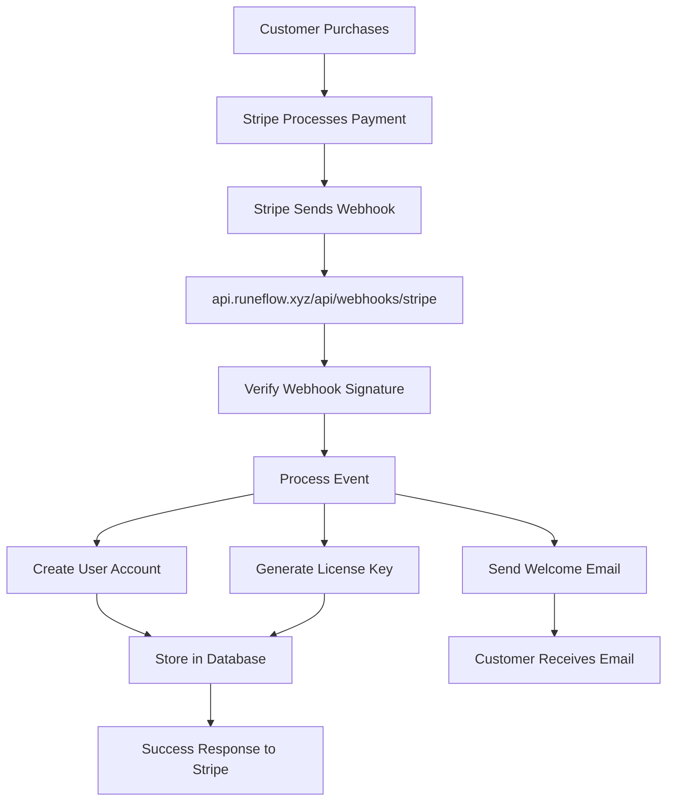

# 🔐 Stripe Webhook Configuration Guide

## 📍 Your Webhook Endpoint
```
https://api.runeflow.xyz/api/webhooks/stripe
```

---

## 🚀 Step-by-Step Setup

### Step 1: Access Stripe Dashboard
1. Go to [Stripe Dashboard](https://dashboard.stripe.com)
2. Navigate to **Developers** → **Webhooks**
3. Click **"Add endpoint"**

### Step 2: Configure Webhook Endpoint
Fill in these details:

**Endpoint URL:**
```
https://api.runeflow.xyz/api/webhooks/stripe
```

**Description:**
```
RuneRush Production Webhook - Handles payments and order fulfillment
```

### Step 3: Select Events to Listen For

Select these critical events:

#### 💳 Payment Events (Required)
- [x] `checkout.session.completed` - Main purchase completion
- [x] `checkout.session.expired` - Checkout timeout
- [x] `checkout.session.async_payment_succeeded` - Delayed payment success

#### 💰 Payment Intent Events
- [x] `payment_intent.succeeded` - Direct payment success
- [x] `payment_intent.payment_failed` - Payment failure

#### 🔄 Subscription Events (If using subscriptions)
- [ ] `customer.subscription.created`
- [ ] `customer.subscription.updated`
- [ ] `customer.subscription.deleted`
- [ ] `invoice.payment_succeeded`
- [ ] `invoice.payment_failed`

#### 📧 Customer Events
- [x] `customer.created` - New customer registration
- [x] `customer.updated` - Customer info update

#### 💳 Charge Events
- [x] `charge.succeeded` - Successful charge
- [x] `charge.failed` - Failed charge
- [x] `charge.refunded` - Refund processed

### Step 4: Get Your Webhook Secret

After creating the webhook:
1. Click on the webhook you just created
2. Click **"Reveal"** under **Signing secret**
3. Copy the secret (starts with `whsec_`)
4. You'll need to add this to Railway

**Example format:**
```
whsec_abcdef123456789...
```

---

## 🔧 Add Webhook Secret to Railway

### In Railway Dashboard:
1. Go to your project
2. Click on **Variables** tab
3. Add/Update this variable:

```env
STRIPE_WEBHOOK_SECRET=whsec_your_actual_secret_here
```

### Verify Other Required Variables:
```env
# These should already be set
STRIPE_SECRET_KEY=sk_live_...
STRIPE_PUBLISHABLE_KEY=pk_live_...
FRONTEND_URL=https://runeflow.xyz
```

---

## 🧪 Testing Your Webhook

### Option 1: Stripe CLI (Recommended for Testing)

1. **Install Stripe CLI:**
```bash
# macOS
brew install stripe/stripe-cli/stripe

# Or download from
# https://stripe.com/docs/stripe-cli
```

2. **Login to Stripe:**
```bash
stripe login
```

3. **Forward webhooks to local server (for local testing):**
```bash
stripe listen --forward-to localhost:8080/api/webhooks/stripe
```

4. **Trigger test events:**
```bash
# Test checkout completion
stripe trigger checkout.session.completed

# Test payment success
stripe trigger payment_intent.succeeded
```

### Option 2: Test from Stripe Dashboard

1. Go to your webhook endpoint in Stripe Dashboard
2. Click **"Send test webhook"**
3. Select event type
4. Click **"Send test webhook"**

---

## 📝 Webhook Event Flow



---

## 🔍 Webhook Payload Example

```json
{
  "id": "evt_1234567890",
  "object": "event",
  "api_version": "2023-10-16",
  "created": 1234567890,
  "data": {
    "object": {
      "id": "cs_test_1234567890",
      "object": "checkout.session",
      "amount_total": 4900,
      "currency": "usd",
      "customer_details": {
        "email": "customer@example.com",
        "name": "John Doe"
      },
      "payment_status": "paid",
      "metadata": {
        "product_type": "core",
        "user_id": "usr_123"
      }
    }
  },
  "type": "checkout.session.completed"
}
```

---

## ✅ Verification Checklist

- [ ] Webhook endpoint added in Stripe Dashboard
- [ ] Correct URL: `https://api.runeflow.xyz/api/webhooks/stripe`
- [ ] Events selected (especially `checkout.session.completed`)
- [ ] Webhook secret copied
- [ ] Secret added to Railway environment variables
- [ ] Test webhook sent successfully
- [ ] 200 OK response received

---

## 🐛 Troubleshooting

### Webhook Returns 401/403
- Check `STRIPE_WEBHOOK_SECRET` in Railway
- Ensure it matches exactly (no extra spaces)

### Webhook Returns 404
- Verify URL is exactly: `https://api.runeflow.xyz/api/webhooks/stripe`
- Check Railway deployment is live

### Webhook Returns 500
- Check Railway logs: `railway logs`
- Verify database connection
- Check all environment variables

### No Response
- Check CORS settings
- Verify Railway is running
- Test API health: `curl https://api.runeflow.xyz/api/health`

---

## 📊 Monitoring Webhooks

### In Stripe Dashboard:
1. Go to **Developers** → **Webhooks**
2. Click on your endpoint
3. View **"Webhook attempts"** tab
4. Check for successful/failed deliveries

### Success Indicators:
- ✅ Status code: 200
- ✅ Response time: < 20 seconds
- ✅ No retry attempts

### Failure Indicators:
- ❌ Status code: 4xx or 5xx
- ❌ Timeouts
- ❌ Multiple retry attempts

---

## 🔒 Security Best Practices

1. **Always verify webhook signatures**
2. **Use HTTPS only (never HTTP)**
3. **Implement idempotency** (handle duplicate events)
4. **Log all webhook events**
5. **Set up alerts for failures**
6. **Rotate webhook secrets periodically**

---

## 📞 Support Resources

- **Stripe Webhook Docs**: https://stripe.com/docs/webhooks
- **Stripe Dashboard**: https://dashboard.stripe.com/webhooks
- **Test Events**: https://dashboard.stripe.com/test/webhooks
- **Stripe Support**: https://support.stripe.com

---

**Last Updated**: August 2025
**Status**: Ready for Configuration
