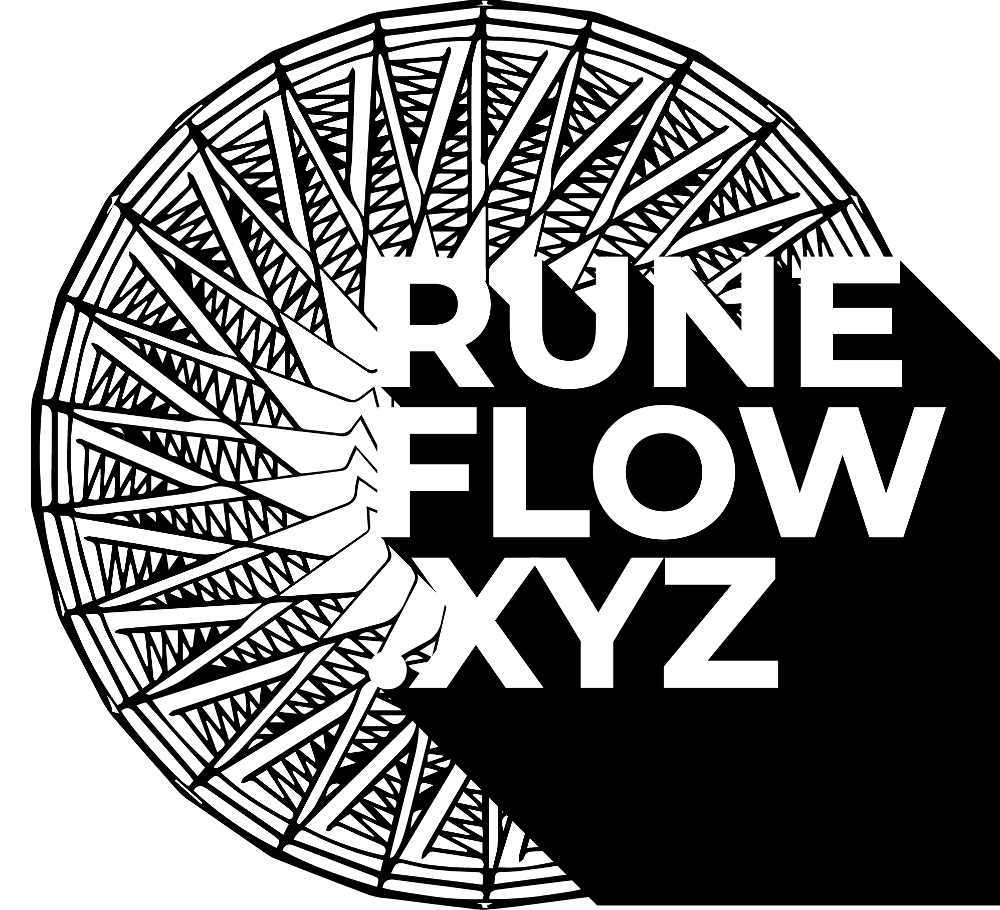

# RuneRush Website Footer Code

This document contains the standardized footer HTML and CSS code used across all RuneRush HTML pages for consistent branding and navigation.

## Footer HTML Structure

Place this footer code just before the closing `</body>` tag in each HTML file:

```html
<footer style="
    background: radial-gradient(circle at center, #1a1a1a 0%, #0d0d0d 100%);
    border-top: 1px solid #333;
    padding: 30px 20px;
    margin-top: 50px;
    backdrop-filter: blur(10px);
    position: relative;
    width: 100%;
">
    <div style="
        max-width: 1200px;
        margin: 0 auto;
        display: flex;
        justify-content: space-between;
        align-items: center;
        flex-wrap: wrap;
    ">
        <!-- Left: Logo -->
        <div style="flex: 1;">
            <a href="https://runeflow.xyz/index.html" style="text-decoration: none;">
                
            </a>
        </div>
        
        <!-- Center: Navigation Links -->
        <div style="
            flex: 1;
            text-align: center;
            color: #ffffff;
            font-family: 'Segoe UI', Tahoma, Geneva, Verdana, sans-serif;
        ">
            <div style="margin-bottom: 10px;">
                <a href="contact.html" style="
                    color: #ffffff;
                    text-decoration: none;
                    margin: 0 10px;
                    transition: color 0.3s ease;
                " onmouseover="this.style.color='#00ffff'" onmouseout="this.style.color='#ffffff'">Contact</a>
                <span style="color: #666;">|</span>
                <a href="privacy.html" style="
                    color: #ffffff;
                    text-decoration: none;
                    margin: 0 10px;
                    transition: color 0.3s ease;
                " onmouseover="this.style.color='#00ffff'" onmouseout="this.style.color='#ffffff'">Privacy</a>
                <span style="color: #666;">|</span>
                <a href="https://runeflow.xyz/index.html" style="
                    color: #ffffff;
                    text-decoration: none;
                    margin: 0 10px;
                    transition: color 0.3s ease;
                " onmouseover="this.style.color='#00ffff'" onmouseout="this.style.color='#ffffff'">RuneFlow</a>
            </div>
            <div>
                <a href="core.html" style="
                    color: #ffffff;
                    text-decoration: none;
                    margin: 0 10px;
                    transition: color 0.3s ease;
                " onmouseover="this.style.color='#00ffff'" onmouseout="this.style.color='#ffffff'">Core</a>
                <span style="color: #666;">|</span>
                <a href="pro.html" style="
                    color: #ffffff;
                    text-decoration: none;
                    margin: 0 10px;
                    transition: color 0.3s ease;
                " onmouseover="this.style.color='#00ffff'" onmouseout="this.style.color='#ffffff'">Pro</a>
                <span style="color: #666;">|</span>
                <a href="complete.html" style="
                    color: #ffffff;
                    text-decoration: none;
                    margin: 0 10px;
                    transition: color 0.3s ease;
                " onmouseover="this.style.color='#00ffff'" onmouseout="this.style.color='#ffffff'">Complete</a>
            </div>
        </div>
        
        <!-- Right: Made with Warp -->
        <div style="flex: 1; text-align: right;">
            <a href="https://app.warp.dev/referral/N36M5R" style="
                color: #00ffff;
                text-decoration: none;
                font-family: 'Segoe UI', Tahoma, Geneva, Verdana, sans-serif;
                font-size: 14px;
                text-shadow: 0 0 10px rgba(0, 255, 255, 0.5);
                transition: text-shadow 0.3s ease;
            " onmouseover="this.style.textShadow='0 0 20px rgba(0, 255, 255, 0.8)'" 
               onmouseout="this.style.textShadow='0 0 10px rgba(0, 255, 255, 0.5)'">made with warp</a>
        </div>
    </div>
    
    <!-- Mobile Responsive Styles -->
    <style>
        @media (max-width: 768px) {
            footer div[style*="display: flex"] {
                flex-direction: column !important;
                align-items: center !important;
                text-align: center !important;
            }
            
            footer div[style*="flex: 1"] {
                flex: none !important;
                margin: 10px 0 !important;
                width: 100% !important;
                text-align: center !important;
            }
        }
    </style>
</footer>
```

## Footer Features

### Layout Structure
- **Left**: RuneFlow logo with link back to main site
- **Center**: Two-row navigation menu
  - Top row: Contact | Privacy | RuneFlow
  - Bottom row: Core | Pro | Complete
- **Right**: "made with warp" link with referral

### Styling Details
- **Background**: Dark radial gradient (#1a1a1a to #0d0d0d)
- **Border**: Top border with #333 color
- **Logo**: 60px height with cyan drop shadow and hover effect
- **Links**: White text with cyan (#00ffff) hover transitions
- **Typography**: Segoe UI font family
- **Spacing**: 30px padding, 50px top margin

### Interactive Effects
- Logo hover: Enhanced cyan glow
- Link hover: Color transition to cyan
- "made with warp" hover: Enhanced text shadow

### Responsive Design
- Mobile breakpoint: 768px
- Mobile layout: Stacked vertical alignment, centered content
- Flexible layout maintains readability on all screen sizes

## Usage Instructions

1. Copy the entire footer HTML block
2. Paste it just before the closing `</body>` tag in your HTML file
3. Ensure the logo image path is correct: `images/runeflow-logo.png`
4. Verify all internal links point to existing pages (core.html, pro.html, complete.html, etc.)

## File Dependencies

- **Logo Image**: `images/runeflow-logo.png`
- **Internal Pages**: core.html, pro.html, complete.html, privacy.html, contact.html
- **External Links**: 
  - https://runeflow.xyz/index.html (main site)
  - https://app.warp.dev/referral/N36M5R (warp referral)

## Last Updated
Footer design standardized across all RuneRush pages - January 2024

---

*This footer provides consistent branding, navigation, and attribution across the entire RuneRush website while maintaining a professional dark theme aesthetic.*
